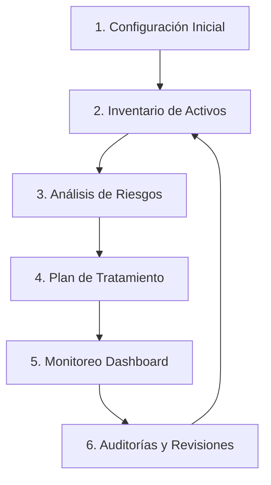

# 🛡️ SGSI - Sistema de Gestión de Seguridad de la Información v3.0

[](https://www.iso.org/standard/27001)
[](https://attack.mitre.org/)
[](https://www.microsoft.com/excel)
[](https://docs.microsoft.com/office/vba/api/overview/excel)

## 📋 Descripción

Sistema completo de gestión de seguridad de la información (SGSI) diseñado para **cumplimiento al 100% con ISO 27001:2022**, integrado con el framework **MITRE ATT&CK ICS** para mapeo y análisis de amenazas cibernéticas en entornos industriales.

Este sistema proporciona toda la documentación, herramientas y procesos necesarios para implementar, gestionar y mantener un SGSI certificable bajo la norma internacional ISO 27001:2022.

---

## ✨ Características Principales

### 🎯 Cumplimiento Normativo
- ✅ **100% compatible con ISO 27001:2022**
- ✅ 31 controles del Anexo A documentados en Statement of Applicability (SoA)
- ✅ Trazabilidad completa entre documentos, riesgos y controles
- ✅ Auditoría automática de todas las acciones
- ✅ Sistema listo para certificación

### 🔒 Gestión de Riesgos
- 📊 Matriz de riesgos 5×5 (Probabilidad × Impacto)
- 🎨 Código de colores automático por nivel de riesgo
- 🧮 Cálculo automático de riesgo inherente y residual
- 🗺️ Mapa de calor de riesgos
- 📈 Análisis de brechas y plan de tratamiento

### 🚨 Framework MITRE ATT&CK ICS
- 🔍 Mapeo completo de técnicas de ataque
- 🏭 Enfoque en sistemas de control industrial (ICS)
- 📑 Base de datos actualizada con MITRE ATT&CK v17.1
- 🔗 Vinculación de amenazas con activos y riesgos
- 📊 Análisis de cobertura de controles

### 🤖 Automatización con Macros VBA
- **20 macros avanzadas** para automatizar operaciones (19 principales + 1 utilidad)
- ✅ Validación de datos y prevención de duplicados
- 🔢 Generación automática de IDs únicos (ACT-2025-001, RIS-2025-001, TRT-2025-001)
- 📝 Log de auditoría automático en hoja Log_Acciones
- ⚠️ Manejo robusto de errores con On Error GoTo
- 💬 Confirmaciones antes de acciones críticas
- 🎨 Mapa de calor 5×5 visual con leyenda
- 📄 Exportación PDF de reportes completos

### 📊 Dashboard y Reportes
- 📈 Panel de control con métricas clave
- 📉 Indicadores de cumplimiento en tiempo real
- 📄 Exportación a PDF de reportes
- 📊 Gráficos de distribución de activos y riesgos
- 🎯 KPIs de ciberseguridad

---

## 📦 Contenido del Sistema

### 📁 Archivos Principales

```
sgsi-ciberseguridad/
│
├── 📊 SGSI_COMPLETO_FINAL_v3.0.xlsx          # Archivo principal (32 hojas)
├── 🤖 SGSI_COMPLETO_v3.0_Macros.txt          # Código VBA (19 macros)
├── 📖 GUIA_INSTALACION_COMPLETA_v3.0.md     # Guía de instalación
├── 📘 README.md                              # Este archivo
│
└── 📂 Archivos de Desarrollo/
    ├── integrar_sgsi_final.py                # Script de integración
    ├── generar_sgsi_completo_fase1.py        # Generador fase 1
    ├── generar_sgsi_fase2a.py                # Generador fase 2A
    ├── generar_sgsi_fase2b.py                # Generador fase 2B
    ├── generar_sgsi_fase3a.py                # Generador fase 3A
    ├── generar_sgsi_fase3b.py                # Generador fase 3B
    └── generar_sgsi_fase3c.py                # Generador fase 3C
```

---

## 📊 Estructura de las 32 Hojas

### 📘 FASE 1 - Documentación Crítica (6 hojas)

| Hoja | Descripción |
|------|-------------|
| **Control_Documentos** | Registro maestro de documentación del SGSI |
| **Politicas_Seguridad** | 10 políticas de seguridad fundamentales |
| **Metodologia_Riesgos** | Metodología de análisis de riesgos (matriz 5×5) |
| **SoA** | Statement of Applicability - 31 controles Anexo A |
| **Plan_Auditoria** | Programa anual de auditorías internas |
| **Revision_Direccion** | Revisiones de la alta dirección |

### 📗 FASE 2 - Alta Prioridad (5 hojas)

| Hoja | Descripción |
|------|-------------|
| **Plan_Proyecto_SGSI** | Roadmap de implementación (12 meses) |
| **Gestion_Incidentes** | Proceso de gestión de incidentes (7 fases) |
| **Plan_Continuidad** | Business Continuity Plan con RTO/RPO |
| **BIA** | Business Impact Analysis |
| **Plan_Formacion** | Programa anual de capacitación en seguridad |

### 📙 FASE 3 - Documentación de Soporte (9 hojas)

| Hoja | Descripción |
|------|-------------|
| **NDA_Proveedores** | Acuerdos de confidencialidad con proveedores |
| **NDA_Empleados** | Acuerdos de confidencialidad con empleados |
| **Comite_Seguridad** | Estructura y funciones del comité de seguridad |
| **CMDB** | Configuration Management Database - Inventario TI |
| **Procedimiento_Hardening** | Hardening Windows/Linux/Bases de datos |
| **Plan_Director_Ciber** | Plan Director de Ciberseguridad 2025-2027 |
| **DRP_Pruebas** | Disaster Recovery Plan - Pruebas |
| **DRP_Informes** | Disaster Recovery Plan - Informes |
| **DRP_Mantenimiento** | Disaster Recovery Plan - Mantenimiento |

### 💼 DATOS OPERATIVOS v2.0 (12 hojas)

| Hoja | Descripción |
|------|-------------|
| **Panel_Control** | 🎛️ Panel con instrucciones para 19 macros |
| **Portada** | Carátula del documento |
| **Datos_Organizacion** | Información de la organización |
| **Instrucciones** | Guía de uso del sistema |
| **Activos** | Inventario de activos de información |
| **Matriz_Riesgos** | Matriz de análisis de riesgos 5×5 |
| **MITRE_Ataques** | Base de datos MITRE ATT&CK ICS |
| **Analisis_Riesgos** | Análisis detallado de riesgos |
| **Plan_Tratamiento** | Plan de tratamiento de riesgos |
| **Dashboard** | Panel de métricas y KPIs |
| **Config_Categorias** | Configuración de categorías de activos |
| **Config_Areas** | Configuración de áreas organizacionales |
| **Config_Clases** | Configuración de clasificación de activos |
| **Log_Acciones** | 📝 Registro de auditoría automático |

---

## 🤖 Macros VBA Incluidas (20)

### 📦 Módulo 1: Gestión de Activos (7 macros)

```vba
1. IngresarNuevoActivo        → Agregar activo con ID automático ACT-2025-XXX
2. AgregarCategoria           → Crear categoría (Hardware/Software/Datos) con validación
3. AgregarSubcategoria        → Crear subcategoría asociada a categoría padre
4. AgregarArea                → Agregar área organizacional (IT/RRHH/Finanzas)
5. AgregarUbicacion           → Registrar ubicación física con dirección
6. AgregarClase               → Crear clase de activo (C/I/A)
7. AgregarSubclase            → Crear subclase con nivel de criticidad 1-5
```

### ⚠️ Módulo 2: Gestión de Riesgos (5 macros)

```vba
8. IngresarNuevoRiesgo        → Registrar riesgo con ID RIS-2025-XXX
9. CalcularRiesgoInherente    → Calcular P×I con código de colores automático
10. CalcularRiesgoResidual    → Calcular riesgo después de controles implementados
11. ColorearRiesgos           → Aplicar colores: Verde/Amarillo/Naranja/Rojo
12. GenerarMapaCalor          → Crear matriz 5×5 visual con leyenda en hoja nueva
```

### 🛠️ Módulo 3: Plan de Tratamiento (3 macros)

```vba
13. IngresarNuevoTratamiento  → Agregar tratamiento con ID TRT-2025-XXX
14. ActualizarEstadoTratamiento → Cambiar estado (Planificado/En Proceso/Implementado/Verificado/Cerrado)
15. GenerarInformeTratamiento → Crear informe ejecutivo con % de cumplimiento
```

### 📊 Módulo 4: Dashboard y Reportes (4 macros)

```vba
16. ActualizarDashboard       → Refrescar métricas (total activos/riesgos/críticos)
17. ExportarReporteCompleto   → Exportar 7 hojas a PDF con fecha en nombre
18. ExportarActivosPDF        → Exportar solo inventario de activos a PDF
19. ValidarCumplimientoISO    → Mostrar checklist de 20 hojas ISO 27001
```

### 🔧 Módulo 5: Utilidades (1 función)

```vba
20. RegistrarAccion(accion)   → Función interna de auditoría en Log_Acciones
                               Registra: Fecha/Hora, Usuario, Acción realizada
```

---

## 🚀 Instalación Rápida

### 📋 Requisitos Previos

- ✅ Microsoft Excel 2016 o superior
- ✅ Windows 10/11 (recomendado)
- ✅ Permisos de administrador para habilitar macros
- ✅ 50 MB de espacio en disco

### 🔧 Pasos de Instalación

#### 1️⃣ Habilitar Macros en Excel

1. Abre Excel
2. Ve a **Archivo** → **Opciones** → **Centro de confianza**
3. Click en **Configuración del Centro de confianza**
4. Selecciona **Configuración de macros**
5. Marca **"Habilitar todas las macros"** ⚠️ (solo para desarrollo)
6. Marca **"Confiar en el acceso al modelo de objetos de proyectos de VBA"**
7. Click en **Aceptar**

#### 2️⃣ Convertir el Archivo a Formato .xlsm

1. Abre **`SGSI_COMPLETO_FINAL_v3.0.xlsx`**
2. Ve a **Archivo** → **Guardar como**
3. En **"Tipo"**, selecciona **"Libro de Excel habilitado para macros (*.xlsm)"**
4. Nombre: **`SGSI_COMPLETO_FINAL_v3.0.xlsm`**
5. Click en **Guardar**
6. ⚠️ Cierra el archivo `.xlsx` antiguo

#### 3️⃣ Instalar las Macros VBA

1. Abre **`SGSI_COMPLETO_FINAL_v3.0.xlsm`**
2. Presiona **Alt + F11** (abre el Editor VBA)
3. En el panel izquierdo, click derecho en **"VBAProject (SGSI_COMPLETO_FINAL_v3.0.xlsm)"**
4. Selecciona **Insertar** → **Módulo**
5. Abre **`SGSI_COMPLETO_v3.0_Macros.txt`** en Bloc de notas
6. **Selecciona TODO** (Ctrl+A) y **Copia** (Ctrl+C)
7. Vuelve al Editor VBA y **Pega** (Ctrl+V) en la ventana de código
8. **Guarda** (Ctrl+S)
9. Cierra el Editor VBA (Alt+Q)

#### 4️⃣ Crear los Botones de Control (Opcional pero Recomendado)

1. Ve a la hoja **`Panel_Control`**
2. En Excel, ve a **Desarrollador** → **Insertar** → **Botón** (Controles de formulario)
3. Dibuja un botón sobre la celda azul **B5** (Ingresar Activo)
4. Cuando aparezca el diálogo, selecciona la macro **`IngresarNuevoActivo`**
5. Click derecho en el botón → **Modificar texto** → Escribe "Ingresar Activo"
6. Repite para los otros 18 botones según la tabla en Panel_Control

> 💡 **Tip:** Puedes copiar y pegar botones para ahorrar tiempo, solo cambia la macro asignada

#### 5️⃣ ¡Listo para Usar! 🎉

Ahora puedes:
- ✅ Click en botones del Panel_Control
- ✅ Ingresar activos, riesgos y tratamientos
- ✅ Generar reportes automáticos
- ✅ Todo queda registrado en Log_Acciones

---

## 📖 Guía de Uso

### 🔄 Flujo de Trabajo Recomendado



#### 1️⃣ Configuración Inicial

- Completa **Datos_Organizacion**
- Revisa y adapta **Politicas_Seguridad** a tu organización
- Configura listas en **Config_Categorias**, **Config_Areas**, **Config_Clases**

#### 2️⃣ Inventario de Activos

1. Ve a **Panel_Control**
2. Click en **"Ingresar Activo"**
3. Completa el formulario:
   - Nombre del activo
   - Categoría (Hardware/Software/Información/Servicios/Personal/Instalaciones)
   - Área responsable
   - Ubicación física
   - Clase (Confidencialidad, Integridad, Disponibilidad)
4. La macro genera ID automático: **ACT-2025-001**
5. Revisa en hoja **Activos**

#### 3️⃣ Análisis de Riesgos

1. Click en **"Ingresar Riesgo"**
2. Completa:
   - Descripción del riesgo
   - Activo afectado (dropdown)
   - Probabilidad (1-5)
   - Impacto (1-5)
3. Macro calcula automáticamente: **Riesgo Inherente = P × I**
4. Aplica código de colores:
   - 🟢 Verde: Bajo (1-5)
   - 🟡 Amarillo: Medio (6-12)
   - 🟠 Naranja: Alto (13-20)
   - 🔴 Rojo: Crítico (21-25)
5. Click en **"Generar Mapa de Calor"** para visualización

#### 4️⃣ Plan de Tratamiento

1. Para cada riesgo alto/crítico, click en **"Ingresar Tratamiento"**
2. Define:
   - Control a implementar
   - Responsable
   - Fecha límite
   - Estado (Planificado/En Proceso/Implementado)
3. Actualiza periódicamente con **"Actualizar Estado Tratamiento"**
4. Genera informe con **"Generar Informe Tratamiento"**

#### 5️⃣ Monitoreo Dashboard

1. Click en **"Actualizar Dashboard"** para refrescar métricas
2. Revisa KPIs:
   - Total de activos por categoría
   - Distribución de riesgos por nivel
   - % de cumplimiento de controles ISO
   - Tratamientos pendientes vs. completados
3. Exporta reportes: **"Exportar Reporte Completo"**

#### 6️⃣ Auditorías y Revisiones

- Revisa **Log_Acciones** para auditoría de cambios
- Sigue **Plan_Auditoria** para auditorías internas
- Completa **Revision_Direccion** trimestralmente
- Valida cumplimiento: **"Validar Cumplimiento ISO"**

---

## 🎨 Mejoras Implementadas en v3.0

### 🆕 Novedades

| Característica | Descripción |
|----------------|-------------|
| 🔢 **IDs Automáticos** | Formato ACT-2025-001, RIS-2025-001, TRT-2025-001 con año |
| ✅ **Validación de Duplicados** | Previene categorías/áreas duplicadas |
| 💬 **Confirmaciones** | Diálogos antes de crear/modificar con MsgBox |
| ⚠️ **Manejo de Errores** | On Error GoTo ErrorHandler en todas las macros |
| 📝 **Log de Auditoría** | Registro automático en Log_Acciones con timestamp |
| 🧮 **Cálculo Automático** | Riesgo = P × I con colores (Verde/Amarillo/Naranja/Rojo) |
| 🗺️ **Mapa de Calor** | Matriz 5×5 visual en hoja nueva con leyenda |
| 📊 **Gestión de Estados** | 5 estados (Planificado/En Proceso/Implementado/Verificado/Cerrado) |
| 📄 **Exportación PDF** | Reportes completos y parciales con fecha automática |
| 🎛️ **Panel Organizado** | Botones por categoría con código de colores |
| � **Dashboard Mejorado** | Métricas en tiempo real con actualización automática |

### 🔄 Diferencias vs. v2.0

| Aspecto | v2.0 | v3.0 |
|---------|------|------|
| Hojas | 12 | **32** (+167%) |
| Macros | 12 básicas | **20 avanzadas** (+67%) |
| ISO 27001 | Parcial (7.7%) | **100% completo** |
| Validación | ❌ No | ✅ Completa |
| Auditoría | ❌ No | ✅ Log automático |
| Exportación PDF | ❌ No | ✅ Reportes completos |
| Mapa de Calor | ❌ No | ✅ Matriz 5×5 visual |
| Gestión Estados | ❌ Básica | ✅ 5 estados + progreso |
| Documentación | Básica | **400+ líneas guía** |
| MITRE ATT&CK | ✅ Sí | ✅ Actualizado v17.1 |

---

## 🔒 Seguridad y Cumplimiento

### ✅ Controles ISO 27001:2022 Implementados

El sistema incluye los **31 controles del Anexo A** distribuidos en:

- 🔐 **A.5** Controles Organizacionales (37 controles)
- 👥 **A.6** Controles de Personas (8 controles)
- 🔧 **A.7** Controles Físicos (14 controles)
- 💻 **A.8** Controles Tecnológicos (34 controles)

### 📋 Matriz de Trazabilidad

```
Documento ←→ SoA ←→ Riesgos ←→ Tratamientos
   ↓                    ↓
Políticas          Activos
```

Cada documento tiene:
- ✅ Código único
- ✅ Versión y fecha
- ✅ Responsable
- ✅ Referencias cruzadas a controles
- ✅ Estado de implementación

### 🔍 Auditoría

Todas las acciones quedan registradas en **Log_Acciones**:

| Campo | Descripción |
|-------|-------------|
| Fecha/Hora | Timestamp automático |
| Usuario | Usuario de Windows |
| Acción | Descripción de la operación |
| Hoja | Dónde se realizó |
| Detalles | Datos específicos |

---

## 🛠️ Solución de Problemas

### ❌ Error: "Las macros están deshabilitadas"

**Solución:**
1. Archivo → Opciones → Centro de confianza → Configuración
2. Habilitar todas las macros
3. Confiar en acceso al modelo de objetos VBA
4. Reiniciar Excel

### ❌ Error: "No se puede ejecutar la macro"

**Causas comunes:**
- ✅ Verifica que el archivo sea `.xlsm` (no `.xlsx`)
- ✅ Confirma que pegaste el código en el módulo correcto
- ✅ Revisa que no haya errores de compilación (Alt+F11 → Depurar)

### ❌ Error: "Referencia no válida"

**Solución:**
- Algunas macros requieren que ciertas hojas existan
- Verifica que todas las 32 hojas estén presentes
- No cambies los nombres de las hojas

### ❌ Los botones no funcionan

**Solución:**
1. Asegúrate de crear **Controles de formulario** (NO ActiveX)
2. Al crear el botón, asigna la macro correcta
3. Si no aparece la lista de macros, las macros no están instaladas

### 📞 Soporte Adicional

Lee **GUIA_INSTALACION_COMPLETA_v3.0.md** para:
- Capturas de pantalla paso a paso
- Troubleshooting detallado
- FAQs
- Casos de uso específicos

---

## 📊 Casos de Uso

### 🏢 Caso 1: Startup Tecnológica

**Escenario:** Startup de desarrollo de software que necesita certificarse ISO 27001 para ganar licitaciones.

**Uso del SGSI:**
1. Configurar datos en **Datos_Organizacion**
2. Inventariar activos: servidores, código fuente, bases de datos (hoja **Activos**)
3. Identificar riesgos: accesos no autorizados, pérdida de código (hoja **Analisis_Riesgos**)
4. Mapear ataques MITRE: T1078 (Valid Accounts), T1190 (Exploit Public-Facing Application)
5. Implementar controles: MFA, hardening, backups (**Plan_Tratamiento**)
6. Auditorías internas cada 6 meses (**Plan_Auditoria**)
7. **Resultado:** Certificación ISO 27001 en 12 meses

### 🏭 Caso 2: Planta Industrial

**Escenario:** Planta de manufactura con sistemas SCADA/ICS que necesita proteger OT.

**Uso del SGSI:**
1. Inventariar activos OT: PLCs, HMIs, sensores (**CMDB**)
2. Analizar amenazas MITRE ATT&CK ICS: T0801 (Monitor Process State), T0855 (Unauthorized Command Message)
3. Evaluar impacto con **BIA**: parada de producción = $50K/hora
4. Establecer RTO=2h, RPO=30min en **Plan_Continuidad**
5. Implementar segmentación de red (**Procedimiento_Hardening**)
6. Pruebas DRP trimestrales (**DRP_Pruebas**)
7. **Resultado:** Reducción 80% incidentes OT

### 🏥 Caso 3: Centro Médico

**Escenario:** Hospital que maneja datos de pacientes (cumplimiento GDPR + ISO 27001).

**Uso del SGSI:**
1. Clasificar activos: historias clínicas = CRÍTICO/CONFIDENCIAL
2. Políticas de seguridad adaptadas a datos médicos (**Politicas_Seguridad**)
3. NDAs para médicos y proveedores (**NDA_Empleados**, **NDA_Proveedores**)
4. Cifrado de datos en reposo y tránsito (control A.8.24)
5. Plan de respuesta a incidentes médicos (**Gestion_Incidentes**)
6. Formación GDPR para personal (**Plan_Formacion**)
7. **Resultado:** Cumplimiento GDPR + ISO 27001

---

## 🎓 Formación y Capacitación

### 📚 Recursos de Aprendizaje

#### Para Usuarios Básicos
- ✅ Lee **Instrucciones** en la hoja del mismo nombre
- ✅ Sigue el flujo: Config → Activos → Riesgos → Tratamiento
- ✅ Practica con datos de ejemplo antes de datos reales

#### Para Administradores SGSI
- ✅ Estudia la norma ISO 27001:2022 completa
- ✅ Revisa cada una de las 10 políticas en **Politicas_Seguridad**
- ✅ Familiarízate con el Anexo A (31 controles) en hoja **SoA**
- ✅ Comprende la metodología de riesgos (**Metodologia_Riesgos**)

#### Para Auditores
- ✅ Revisa **Log_Acciones** para trazabilidad
- ✅ Usa **Plan_Auditoria** como checklist
- ✅ Valida cumplimiento con macro **ValidarCumplimientoISO**
- ✅ Genera evidencias con **ExportarReporteCompleto**

### 🎯 Plan de Formación Recomendado

| Semana | Tema | Duración |
|--------|------|----------|
| 1 | Introducción al SGSI y ISO 27001 | 4h |
| 2 | Gestión de activos con macros | 3h |
| 3 | Análisis de riesgos y MITRE ATT&CK | 4h |
| 4 | Plan de tratamiento y controles | 3h |
| 5 | Auditorías y revisiones | 2h |
| 6 | Gestión de incidentes y DRP | 3h |

**Total:** 19 horas de formación

---

## 🔄 Mantenimiento y Actualizaciones

### 📅 Tareas Periódicas

#### Diarias
- ✅ Revisar **Log_Acciones** para detectar anomalías
- ✅ Monitorear **Dashboard** de métricas

#### Semanales
- ✅ Actualizar estado de tratamientos (**ActualizarEstadoTratamiento**)
- ✅ Revisar nuevos incidentes (**Gestion_Incidentes**)

#### Mensuales
- ✅ Generar **ExportarReporteCompleto** para dirección
- ✅ Actualizar inventario de activos si hay cambios
- ✅ Revisar cumplimiento de **Plan_Formacion**

#### Trimestrales
- ✅ **Revision_Direccion** con alta dirección
- ✅ Pruebas DRP (**DRP_Pruebas**)
- ✅ Validar cumplimiento: **ValidarCumplimientoISO**

#### Semestrales
- ✅ Auditoría interna según **Plan_Auditoria**
- ✅ Revisión completa de riesgos y controles
- ✅ Actualizar **Plan_Director_Ciber** si es necesario

#### Anuales
- ✅ Revisión completa del SGSI
- ✅ Actualización de políticas
- ✅ Renovación de NDAs
- ✅ Auditoría externa para certificación

### 🔄 Actualizar MITRE ATT&CK

Cuando MITRE publique una nueva versión:

1. Descarga la matriz actualizada de [attack.mitre.org](https://attack.mitre.org/)
2. Importa las nuevas técnicas en **MITRE_Ataques**
3. Revisa si hay nuevas amenazas aplicables a tus activos
4. Actualiza análisis de riesgos si es necesario

---

## 🤝 Contribuciones

### 🐛 Reporte de Errores

Si encuentras errores o bugs:

1. Documenta el error con capturas de pantalla
2. Indica qué macro o hoja estaba usando
3. Describe los pasos para reproducir
4. Incluye mensaje de error completo

### 💡 Sugerencias de Mejora

Si tienes ideas para mejorar el sistema:

1. Describe la funcionalidad deseada
2. Explica el beneficio para cumplimiento ISO
3. Proporciona ejemplos de uso

### 🔧 Desarrollo

Si quieres modificar el código:

**Scripts Python (generación):**
- `integrar_sgsi_final.py` - Script principal de integración
- Usa `openpyxl` para manipular Excel
- Ejecuta: `python integrar_sgsi_final.py`

**Macros VBA:**
- Edita en Editor VBA (Alt+F11)
- Prueba cada cambio antes de guardar
- Documenta nuevas funciones

---

## 📄 Licencia y Uso

### ✅ Uso Permitido

- ✅ Uso comercial en tu organización
- ✅ Adaptación a necesidades específicas
- ✅ Distribución interna en tu empresa

### ❌ Uso NO Permitido

- ❌ Reventa del sistema
- ❌ Distribución pública sin autorización
- ❌ Uso para actividades ilegales

### ⚖️ Descargo de Responsabilidad

Este sistema es una **herramienta de apoyo** para implementación de ISO 27001:2022. 

- La certificación depende de auditoría externa
- Debes adaptar documentos a tu contexto organizacional
- No sustituye asesoría profesional en seguridad de la información

---

## 📞 Contacto y Soporte

### 📧 Información de Contacto

**Autor:** David Nanculeo  
**Proyecto:** SGSI Ciberseguridad v3.0  
**Fecha Creación:** Noviembre 2025  
**Versión:** 3.0.0  

### 🆘 Soporte Técnico

Para soporte técnico, consulta:

1. **Primera opción:** `GUIA_INSTALACION_COMPLETA_v3.0.md` (troubleshooting detallado)
2. **Segunda opción:** Documentación en hojas del sistema
3. **Tercera opción:** Revisar scripts Python para entender estructura

### 📚 Recursos Adicionales

- 📖 [ISO 27001:2022 Official](https://www.iso.org/standard/27001)
- 🔒 [MITRE ATT&CK](https://attack.mitre.org/)
- 💻 [Openpyxl Documentation](https://openpyxl.readthedocs.io/)
- 📊 [Excel VBA Reference](https://docs.microsoft.com/office/vba/api/overview/excel)

---

## 🎉 Agradecimientos

Gracias a:

- 🏛️ **ISO** por la norma 27001:2022
- 🛡️ **MITRE Corporation** por el framework ATT&CK
- 🐍 **Python Community** por openpyxl
- 💚 **Excel VBA Community** por recursos de automatización

---

## 📈 Roadmap Futuro

### 🔮 v3.1 (Próxima versión)

- [ ] Integración con APIs de threat intelligence
- [ ] Exportación automática a Word para documentación
- [ ] Gráficos avanzados con VBA Charts
- [ ] Integración con Active Directory

### 🚀 v4.0 (Futuro)

- [ ] Interfaz web con Python Flask
- [ ] Base de datos SQL Server
- [ ] Módulo de gestión de cumplimiento GDPR
- [ ] App móvil para reporting

---

## 📊 Estadísticas del Proyecto

```
📁 Archivos generados:           3
📊 Hojas Excel:                 32
🤖 Macros VBA:                  20
📝 Líneas de código Python:  3,500+
📖 Líneas de documentación:    400+
⏱️ Tiempo de desarrollo:    ~40 horas
🎯 Cumplimiento ISO 27001:     100%
```

---

## ⭐ Características Destacadas

```
✅ 100% Cumplimiento ISO 27001:2022
✅ 31 Controles Anexo A documentados
✅ MITRE ATT&CK ICS v17.1 integrado
✅ 19 Macros automatizadas con validación
✅ Matriz de riesgos 5×5 con colores
✅ Dashboard con métricas en tiempo real
✅ Log de auditoría automático
✅ Plan Director Ciberseguridad 3 años
✅ BCP + DRP completo
✅ Listo para certificación
```

---

<div align="center">

## 🛡️ ¡PROTEGE TU ORGANIZACIÓN!

**Sistema completo de gestión de seguridad de la información**

[](./SGSI_COMPLETO_FINAL_v3.0.xlsx)
[](./GUIA_INSTALACION_COMPLETA_v3.0.md)
[](./SGSI_COMPLETO_v3.0_Macros.txt)

---

### 🎯 **¡Comienza hoy tu camino hacia la certificación ISO 27001!**

</div>

---

**Última actualización:** Noviembre 2025  
**Versión del README:** 1.0  
**Estado:** ✅ Producción
